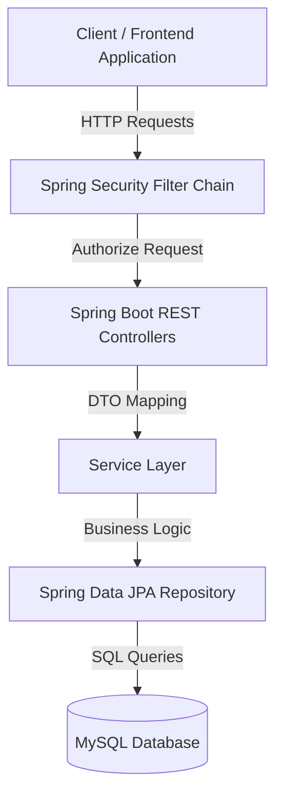

# EdKart Backend API

EdKart is a robust, production-ready e-commerce REST API backend built with **Spring Boot** and **Java 26**. It provides the core business logic and database layer for an online storefront, featuring catalog search, shopping carts, order workflows, and customer reviews.

---

## 🚀 Key Features

- **Product Catalog:** Full CRUD support for products, multiple categories, and dynamic image mappings.
- **Advanced Filtering & Search:** Structured search filtering powered by **Spring Data JPA Specifications**, allowing filtering by brand, category, price range, and ratings.
- **Order Management:** Complete checkout workflow with order creation, order items, and quantity tracking.
- **Customer Reviews:** Dynamic product rating calculation based on customer feedback.
- **Spring Security:** Secured REST APIs with role-based authorization for administrators and users.
- **Database Auto-Seeding:** Automatically populates the MySQL database with sample products and images during the first application startup.

---

## 🛠️ Technology Stack

- **Language:** Java 26
- **Framework:** Spring Boot 3.x
  - Spring Web MVC
  - Spring Data JPA
  - Spring Security
  - Spring Validation
- **Database:** MySQL 8.x
- **Build Tool:** Apache Maven (Maven Wrapper Included)

---

## 📐 Architecture Flow



---

## 📂 Project Structure

```text
edkart/
│
├── .mvn/                                # Maven wrapper configuration
├── src/
│   └── main/
│       ├── java/com/edcode/edkart/
│       │   ├── config/                  # Security & Web Configuration
│       │   ├── controller/              # REST Controllers
│       │   ├── dto/                     # Data Transfer Objects
│       │   ├── entity/                  # JPA Entities
│       │   ├── repository/              # Spring Data JPA Repositories
│       │   ├── seed/                    # Database Seeder
│       │   ├── services/                # Business Logic
│       │   └── spec/                    # JPA Specifications
│       │
│       └── resources/
│           ├── application.properties   # Configuration
│           ├── static/
│           └── templates/
│
├── uploads/
│   └── products/                        # Product Images
│
├── mvnw
├── mvnw.cmd
└── pom.xml
```

---

## 📦 Getting Started

### Prerequisites

- Java 26 JDK
- MySQL Server (Local or Docker)
- Apache Maven (Optional, Maven Wrapper Included)

---

## ⚙️ Environment Configuration

Update your database configuration in:

`src/main/resources/application.properties`

```properties
spring.datasource.url=jdbc:mysql://${MYSQL_HOST:localhost}:3306/edkart
spring.datasource.username=YOUR_MYSQL_USERNAME
spring.datasource.password=YOUR_MYSQL_PASSWORD
```

---

## ▶️ Installation & Run

### 1. Clone the Repository

```bash
git clone https://github.com/EsakkiDurai5602/Springboot_Ecommerce_Project_Edkart.git
cd Springboot_Ecommerce_Project_Edkart
```

### 2. Build the Project

Linux/macOS

```bash
./mvnw clean package
```

Windows

```cmd
mvnw.cmd clean package
```

### 3. Run the Application

Linux/macOS

```bash
./mvnw spring-boot:run
```

Windows

```cmd
mvnw.cmd spring-boot:run
```

---

## 🌐 Server

The application starts on:

```
http://localhost:8080
```

---

## 🔒 Security

- Spring Security
- Role-Based Authorization
- Protected REST Endpoints
- Input Validation
- Exception Handling

---

## 📚 Core Technologies

- Java 26
- Spring Boot
- Spring Web MVC
- Spring Data JPA
- Spring Security
- MySQL
- Maven
- JPA Specifications
- Bean Validation
- RESTful APIs
